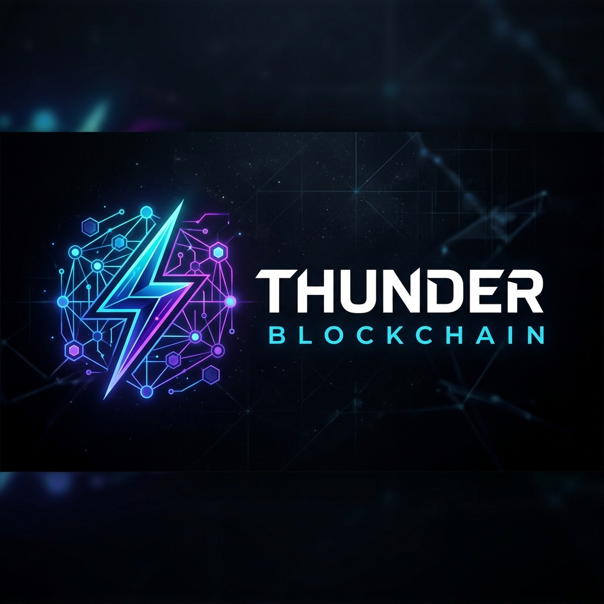

<p align="center">
  
</p>

# 🚀 Thunder Blockchain - High-Performance Decentralized Network
 

## 🌟 Overview

Thunder is a high-performance, modular blockchain network built entirely in Rust. It is designed for maximum throughput, leveraging a DAG-based **Virtual Voting (aBFT)** consensus algorithm (Hashgraph-inspired), and features a custom virtual machine (**ThunderVM**) powered by its own deeply-integrated language (**ThunderScript**).

## 📜 Licensing & Architecture Structure

This project uses dual licensing and is being structured into the following modular components for future scalability:

### 🔐 Blockchain Infrastructure (BSL 1.1)

**Components (Future Architecture):**
- `Core-Engine/` - Consensus (aBFT), mempool, state management, sharding
- `development/` - Node implementation, integration, contracts, ThunderVM
- `audit/` - Security audit tools and compliance tests
- `governance/` - DAO and governance mechanisms
- `deployment/` - Node deployment and orchestration
- `infrastructure/` - RPC API, node infrastructure, backend services
- `testing/` - Integration tests, testnet tools
- `monitoring/` - Production monitoring and metrics

**License:** Business Source License 1.1 - Perpetual Proprietary
**Usage:**
- ✅ Non-production use (testing, development, evaluation) - FREE
- ⚠️ Production use requires commercial license
- 🔒 Proprietary license - remains under BSL 1.1 indefinitely

### 📱 Client Applications (Apache-2.0)

**Components:**
- `applications/thunder-mobile/` - Mobile wallet
- `applications/thunder-wallet/` - Browser extension wallet
- `applications/thunderscan/` - Blockchain explorer
- `applications/thunder-cli/` - Command-line tools (currently in `Core-Engine`)

**License:** Apache License 2.0
**Usage:** Fully open-source - use, modify, distribute freely

---

## 🚀 CORE FEATURES (v1.1.6)

### ⚡ ThunderVM & ThunderScript
- **Stack-based VM**: Extremely lightweight execution environment.
- **Micro-Gas Metering**: Every single opcode executed consumes precise gas to prevent infinite loops and bounded computation.
- **Custom Compiler**: The `thunder-lang` crate contains a full Lexer, Parser, AST Generator, and Compiler that translates ThunderScript directly to Bytecode.

### 🏛️ Directed Acyclic Graph (DAG) aBFT Consensus
- **Virtual Voting**: Nodes do not need to send voting messages across the network. By gossiping "Events" containing 2 hashes (Self-Parent & Other-Parent), every node can mathematically calculate what everyone else would vote for.
- **Leaderless**: No block producers or leaders to attack. All nodes produce events continually.
- **Absolute Finality**: Transactions reach 100% mathematical finality without probabilistic rollbacks.

### 🔐 Cryptography & Storage
- **Ed25519 Signatures**: Ultra-fast signature verification using `ed25519-dalek`.
- **SHA-256 State Roots**: Strong 256-bit cryptographic Merkle Trees for state validation.
- **RocksDB State**: High-performance multithreaded raw block and world-state persistent storage (`rust-rocksdb`) built natively via C++ bindings for blazing fast disk I/O.

### 🌐 Peer-to-Peer Network
- **LibP2P Integration**: Secure and modular networking via `libp2p`.
- **GossipSub Integration**: Decentralized event propagation with mesh networking.
- **Kademlia DHT**: Node discovery without centralized bootstrap servers.

---

## 🏆 ACHIEVED ROADMAP SUMMARY (v1.1.X)

- **✅ Phase 1: Core Foundation**
  Implementation of the DAG-based aBFT Consensus, ThunderScript Compiler, and Virtual Machine ecosystem.
  
- **✅ Phase 2: High Performance Engine**
  Implementation of multithreading state querying and the transition to high-throughput RocksDB caching architectures.
  
- **✅ Phase 3: Cross-Chain Validation**
  Deployment of the `thunder-relayer` Ethereum Bridge oracle natively wired via JSON-RPC, featuring VM-level Cryptographic bridging (`VerifySig`, `MStore`).
  
- **✅ Phase 4: Decentralized Testnet deployment**
  Production-grade 3-Node distributed matrix execution powered locally by native Docker Compose isolated topologies.

## ⚠️ UPCOMING UPGRADES (v2.0.0+)

- **Phase 5: Ecosystem Tooling**
  Launch of `ThunderScan` Block Explorer, Browser Wallet Extensions, and comprehensive Web3 SDK for JS/TS frontends.

- **Phase 6: Post-Quantum Cryptography**
  Migrating from Ed25519 to `CRYSTALS-Dilithium` lattice-based signatures to provide mathematical resistance against future quantum computer attacks (e.g., Shor's Algorithm).
  
- **Phase 7: Extreme Scalability Architecture**
  Overhauling ThunderVM for **Object-Centric Parallel Execution** capable of scaling up to 400.000+ TPS via Dynamic State Sharding & ZK-Stateless architecture.

## �️ QUICK START

### Prerequisites
- **Rust**: Edition 2021 (v1.70+)
- **OS**: Linux, macOS, or WSL2

### Building the Project
```bash
git clone https://github.com/suryaguntursuprapto/Thunder-Blockchain.git
cd Thunder-Blockchain
cargo build --release
```

### Running the Node
```bash
# Start a node with the CLI
cargo run -p thunder-cli -- node start --port 9000

# Start a JSON-RPC Server
cargo run -p thunder-rpc
```

---

## 📚 API REFERENCE (JSON-RPC 2.0)

Nodes expose a JSON-RPC endpoint at `http://127.0.0.1:8080`.

**Check Balance:**
```json
{
  "jsonrpc": "2.0",
  "method": "get_balance",
  "params": ["<address>"],
  "id": 1
}
```

**Send Transaction:**
```json
{
  "jsonrpc": "2.0",
  "method": "send_transaction",
  "params": [{
    "sender": "<address>",
    "recipient": "<address>",
    "amount": 1000,
    "nonce": 1,
    "signature": "<hex_signature>"
  }],
  "id": 2
}
```

---

⚠️ **Disclaimer:** Thunder Blockchain is experimental software currently in the Testnet phase. Use at your own risk. Always test thoroughly before securing real assets.
