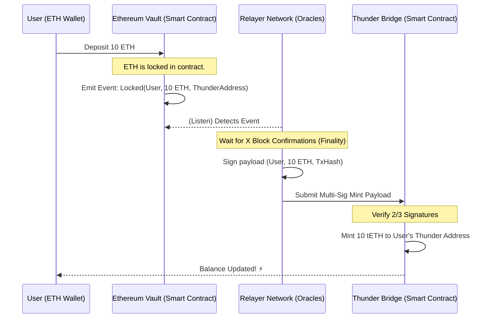
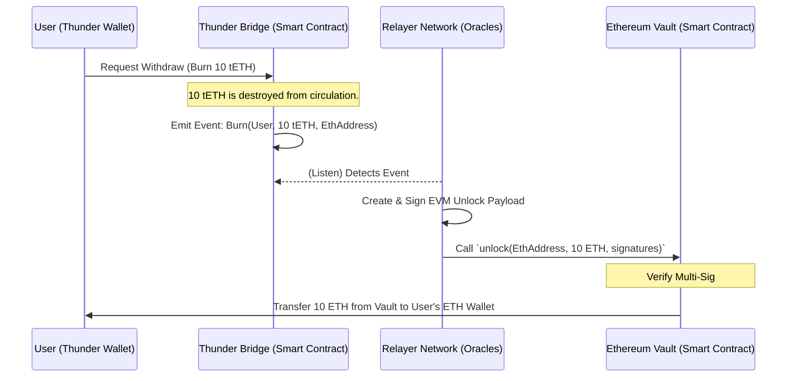

# Thunder Blockchain: Cross-Chain Bridge Architecture 🌉

This document provides a deep technical architecture for the Thunder Cross-Chain Bridge, enabling bi-directional transfers of assets (e.g., BTC, ETH, SOL) between their native networks and Thunder Blockchain.

## 1. Core Architectural Components

The bridge operates on a **Lock & Mint / Burn & Unlock** paradigm. It consists of three primary layers:

### A. The External Vaults (Native Chains)
Smart contracts or custody solutions residing on external blockchains.
*   **Ethereum (EVM)**: A Solidity Smart Contract (`Vault.sol`) that allows users to deposit ETH or ERC-20 tokens. It locks the funds and emits a `Deposit` event.
*   **Solana**: A Rust-based Solana Program holding wrapped assets or native SOL in a Program Derived Address (PDA).
*   **Bitcoin**: Since BTC does not have smart contracts, a **Threshold Signature Scheme (TSS)** wallet utilizing Taproot is used as a decentralized custody vault.

### B. The Relayer Network (Oracle Nodes)
A decentralized network of off-chain Rust/Node.js validator nodes.
*   **Role**: They constantly listen to RPC nodes of both Thunder and external chains (e.g., Infura for ETH, self-hosted nodes for Thunder).
*   **Consensus (Multi-Sig)**: To prevent a single point of failure or malicious minting, the bridge requires a **2/3 supermajority** (e.g., 5 out of 7 Oracles) to sign off on any cross-chain event.

### C. Thunder Bridge Contract (Thunder Blockchain)
A native ThunderScript smart contract (`bridge.thunder`) that controls the Wrapped Assets (`tETH`, `tBTC`, `tSOL`).
*   It maintains a registry of authorized Relayer public keys.
*   It exposes a `verify_and_mint(payload, signatures)` function that requires cryptographically verifying the 2/3 threshold signature before minting tokens.

---

## 2. Transaction Lifecycles (Sequence Diagrams)

### 2.1 Inbound Diagram: Web3 to Thunder Blockchain (Lock & Mint)

### 2.2 Outbound Diagram: Thunder to Web3 (Burn & Unlock)

---

## 3. High-Level Security & Risk Mitigation

Bridging holds massive systemic risk. The following architecture ensures funds cannot be drained:

1.  **Strict Rate Limiting (Circuit Breakers)**
    *   The `bridge.thunder` contract will enforce a maximum outflow per hour (e.g., 100 tETH per hour). If requested withdrawals exceed this, the bridge automatically pauses and alerts human admins.
2.  **Anti-Replay Protection**
    *   Every cross-chain transaction requires a unique **Nonce** or mapping of the originating `TxHash`. The Thunder contract will log processed hashes to ensure a Mint signature cannot be re-submitted twice.
3.  **TSS for Bitcoin Custody**
    *   Instead of a single custodian holding BTC, a decentralized Multi-Party Computation (MPC) scheme generates a Bitcoin address. No single Oracle holds the private key; they hold key shares that must be mathematically combined to release BTC.
