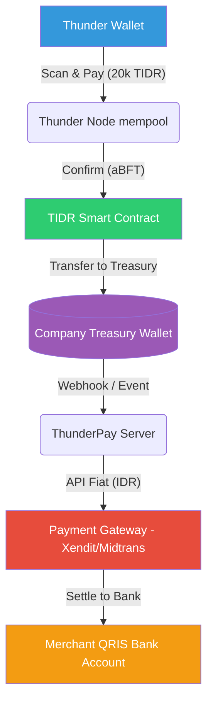
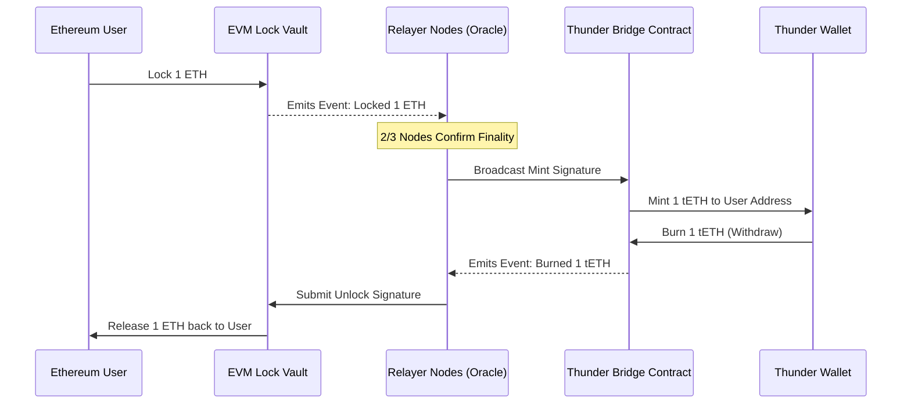

# Thunder Blockchain: Smart Contract & Cross-Chain Integration Plan

## 1. Executive Summary
This document outlines the architectural roadmap and strategic implementation plan for deploying Native Stablecoins (TIDR) and Wrapped Assets (tBTC, tETH, tSOL) via Cross-Chain Bridging on the Thunder Blockchain. This represents **Phase 7** of the overarching Thunder ecosystem expansion.

## 1.1 Architectural Flow (QRIS & Web3)


## 1.2 Cross-Chain Architecture (Lock & Mint)


---

## 2. TIDR Stablecoin Implementation Plan

### 2.1 Architecture
*   **Asset Type**: Fiat-Collateralized Native Stablecoin.
*   **Peg Mechanism**: 1:1 backed by real Indonesian Rupiah (IDR) in a corporate treasury bank account.
*   **Tech Stack**: ThunderScript Native Smart Contract (ERC-20 Equivalent).

### 2.2 Smart Contract Features (`tidr.thunder`)
```text
contract TIDR_Token {
    state total_supply;
    state balances;
    state treasury_admin; // Owner of the contract

    function mint(to, amount) { ... } // Only treasury_admin
    function burn(from, amount) { ... } // Only treasury_admin or self-burn
    function transfer(to, amount) { ... } // Public
}
```

### 2.3 QRIS Web3 Integration Flow
1.  **QRIS Scan**: User scans EMVCo standard barcode via Thunder Wallet App.
2.  **Web3 Transaction**: Thunder Wallet initiates a `transfer()` on the TIDR Smart Contract to the Treasury Wallet.
3.  **Settlement Trigger**: Thunder Node listener detects successful transfer (in ~1 sec due to aBFT).
4.  **Web2 Payout**: Backend server calls Payment Gateway API (e.g., Xendit/Durianpay Disbursement) to send equivalent IDR fiat natively to the Merchant's QRIS Bank Account.

---

## 3. Cross-Chain Bridge Plan (BTC, ETH, SOL)

### 3.1 Architecture (Lock & Mint Mechanism)
The goal is to bring deep liquidity from external chains into Thunder Blockchain via "Wrapped" tokens: **tBTC**, **tETH**, and **tSOL**.

#### A. External Vault Contracts
*   **Ethereum Vault (Solidity)**: Locks real ETH and emits `Locked(user, amount)` events.
*   **Solana Program (Rust)**: Locks real SOL securely in PDA.
*   **Bitcoin Custody**: Threshold Multisig (TSS) utilizing Taproot.

#### B. Bridge Relayer Network (Oracle Nodes)
*   A decentralized network of Rust/Node.js servers that independently monitor External Vaults.
*   **Rule**: When 2/3rd of Relayer Oracles detect a Lock event (e.g., 1 ETH locked), they broadcast a **Minting Signature** to Thunder Blockchain.

#### C. Thunder Blockchain Bridge Contract (`bridge.thunder`)
*   Accepts signatures from approved Relayer Nodes.
*   Triggers `mint()` on the respective wrapped token tracker (e.g., `tETH_Token` contract).
*   Handles **Withdrawals**: Burns the wrapped asset on Thunder and signs a request to the External Vaults to unlock the native asset back to the user's wallet.

---

## 4. Development & Deployment Timeline

### Phase A: EVM / Smart Contract Maturation
*   [ ] Refine ThunderScript parsing for complex state transitions.
*   [ ] Compile `token.thunder` (TIDR layout) and perform local VM testing.
*   [ ] Optionally embed `revm` (EVM compatibility layer) inside `Core-Engine`.

### Phase B: TIDR Stablecoin Private Testnet
*   [ ] Deploy `TIDR` mapping on Thunder Network test nodes.
*   [ ] Build Backend Listener API to sync Web3 events with Web2 Treasury operations.
*   [ ] Integrate mock Payment Gateway (Sandbox) for QRIS Payouts.

### Phase C: Cross-Chain Pilot (Thunder ⇔ Ethereum)
*   [ ] Develop Ethereum Vault Solidity Smart Contract.
*   [ ] Develop multi-chain Oracle Relayers (Rust-based).
*   [ ] Perform stress testing on Mint/Burn symmetry to prevent double-spending exploits.
*   [ ] Security Audit of the Bridge Contract.

## 5. Security Posture
Cross-chain bridges are notorious targets for exploiters. Key safeguards:
1.  **Oracle Collusion Protection**: Implement Multi-Party Computation (MPC) or strict Threshold Signatures across physically separated validator nodes.
2.  **Rate Limiting**: Hard-cap daily Outflow/Inflow bounds directly inside the Bridge Smart Contract limit flash-loan or unbounded minting attacks.
3.  **Auditing**: Strict `-D warnings` and external security audit requirement for all Vault Code.
